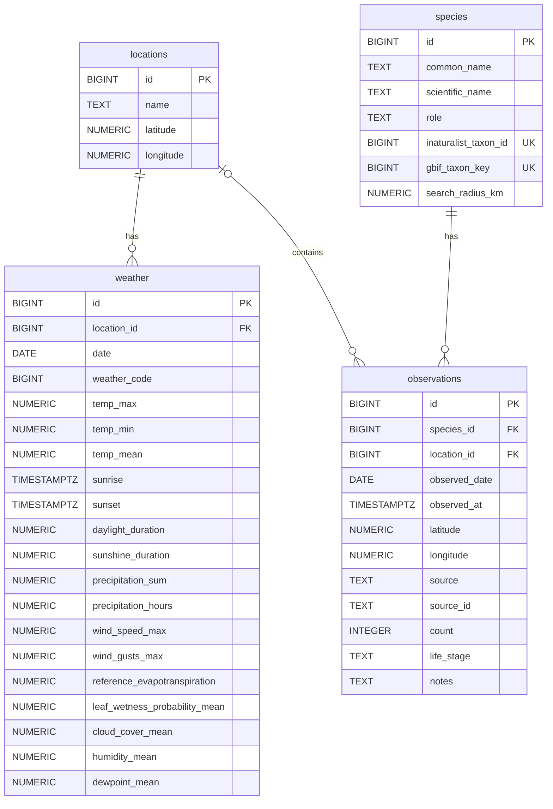

# PestControl

## Project concept

**End goal:**

A personal **garden intelligence and monitoring application** designed to help the user understand and manage conditions in their garden by combining external data sources, historical observations, weather information, local environmental information, and eventually some AI-assisted analysis.

## What has been done so far

### Project foundation

- [x] Created the Python project structure
- [x] Split the application into separate modules for configuration, database access, locations, species, observations, and weather
- [x] Added environment-based configuration using `.env`
- [x] Connected the application to a PostgreSQL database using `psycopg`
- [x] Added project dependencies to `requirements.txt`

### Database

- [x] Created and populated the database tables needed for locations, species, observations, and weather data
- [x] Added database connection handling

### Species and taxonomy

- [x] Integrated the GBIF species matching API
- [x] Integrated the iNaturalist taxonomy API
- [x] Added logic to match species between GBIF and iNaturalist
- [x] Store scientific names and common names
- [x] Store GBIF taxon keys and iNaturalist taxon IDs
- [x] Store a search radius for each species

### Observations

- [x] Integrated the iNaturalist observations API
- [x] Integrated the GBIF occurrence API
- [x] Added geographic-radius searches around configured locations
- [x] Added normalization of iNaturalist and GBIF observations into a common format
- [x] Store observation dates and timestamps, coordinates, the original data source and source ID, available metadata such as individual count, life stage, and notes
- [x] Observations have duplicate protection using `(source, source_id)` in the database

### Weather data

- [x] Integrated the Open-Meteo archive API
- [x] Added collection of daily weather variables relevant to garden monitoring
- [x] Store daily weather data in PostgreSQL
- [x] Weather has a duplicate protection using `(location_id, date)` in DB
- [x] Added a daily weather update function

### Automation / DevOps

- [x] Added a GitHub Actions workflow for automated weather updates
- [x] Configured the workflow to run daily at 10:00 in the `Europe/Bratislava` timezone
- [x] Added manual workflow triggering with `workflow_dispatch`
- [x] Configured the GitHub Actions environment to install the Python dependencies and run the weather update
- [x] Passed the database connection through a GitHub Actions secret

### Species agent
- [ ]

## Technology stack
- **Python**
- **PostgreSQL**
- **psycopg**
- **Requests**
- **Open-Meteo API**
- **iNaturalist API**
- **GBIF API**
- **GitHub Actions**
